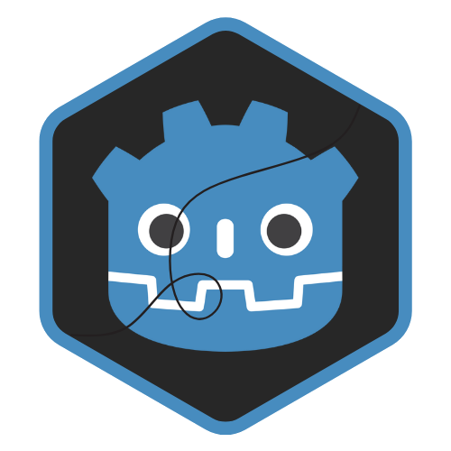

  
  <h2 align="center">Godot Tween Orchestrator</h2>
  
  
Tween Orchestrator is a utility designed to simplify animations in Godot.

  
This addon serves as the foundation for all projects developed in <a href="https://gauchoforge.com/">Gaucho Forge. </a>

<h1 align="center">🔎 Stats</h1>

    
    
    

# 📄​ License
This project is licensed under the MIT License. You are free to modify and use it however you like. Credit is not required, but always appreciated.